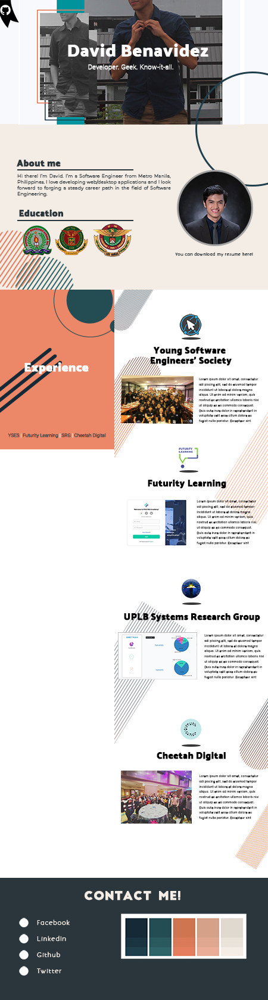

<h1 align="center">
   
  
   
   
  davidralph.dev
   
   
  
   
</h1>
<h4 align="center">My Personal Website</h4>

### Initial Application Design

### Running the application
1. Clone this repository.
2. Install all the dependencies with `npm install` or `yarn install`.
3. Start the development server with `npm start` or `yarn start`.